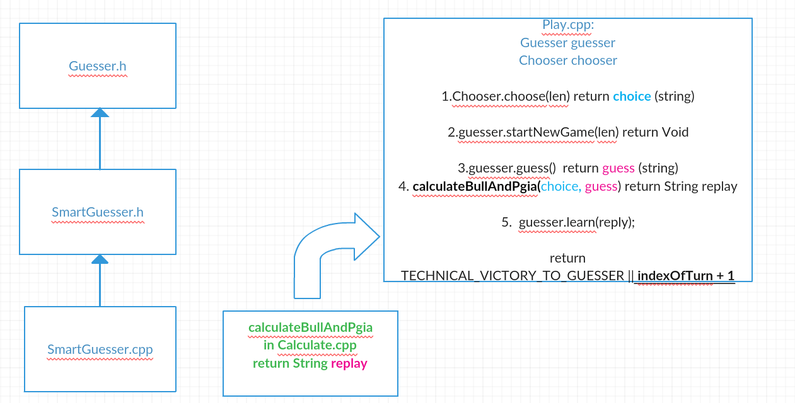

BullAndPgia Project made during CPP course at Ariel University 2019.  
<b>Made by:</b> Zvi Mints and Or Abuhazira and Eilon Tsadok.  

## Purpose: 
In this project we create an automatic player that by an algorithm that we build guess the answer in the game "Bull And Pgia" in really few turns. (Less then 10 untill 7 and  really good result above 7).

## How To Play:
<b>Discover the hidden code! 
Bull = correct code, correct position.  
Pgia = correct code, wrong position. </b> 

Run the function "play" on chooser object, guesser object, amount of numbers in the secret choice, amount of turns untill game is over.
The function "play" return the amount of turns it took for the automatic player to guess the chosen numbers. 
If it return number that is more then the maximum turns that you insert, it is mean that the automatic player (the guesser) loose the game, if it the function return zero it means that the chooser loose the game.

## The Structure Of This Project:

The class Chooser is an abstract class that DummyChoosers is inheritance from, and override some of its functions.

The class Guesser is an abstract class that RandyGuesser, ConstantGuesser and SmartGuesser are inheritance from, and override some of its functions.

The file Calculate.hpp contain the function calculateBullAndPgia that get two string objects, choice string and the guess string, and return the "bull and pgia" string. for example: "1,2" means that there are one "bull" and two "pgia".

The file Play.hpp contain the function play that get Chooser& , Guesser&, uint length and uint maxTurns. The function return the numbers of the turns that take to the guesser the guess the right "secret" choice of the chooser.
it return number that is bigger then the parameter "length" when the automatic player (the guesser) loose the game, and it return zero when the chooser loose the game.
